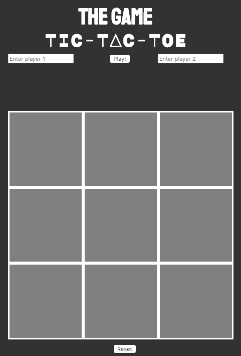
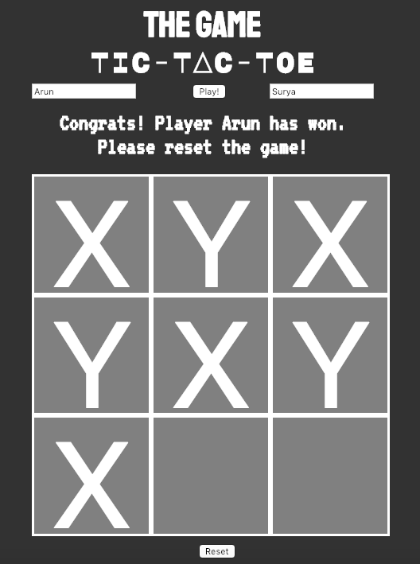

## Project0

## Tic Tac Toe

We're going to be build a tic-tac-toe application using HTML, CSS, and Javascript/jQuery. 

## Getting Started
We are making saparate HTML, CSS, and JS files for this game.

## Technical Requirements
* Render a game board in the browser
* Switch turns between X and O (or whichever markers you select)
* Visually display which side won if a player gets three in a row or show a draw if neither wins
* Include separate HTML / CSS / JavaScript files
* Stick with KISS (Keep It Simple Stupid) and DRY (Don't Repeat Yourself) principles
* Use Javascript for DOM manipulation
* Deploy your game online, where the rest of the world can access it
* Use semantic markup for HTML and CSS (adhere to best practices)
* Allow players to customize their name.

## How To Play
This game only allow you to play with 2 players :
Human vs Human

When the game is loaded, you need to name the players. The first player will be playing 'X'.
Click on the grey squares to move.
Your goal is to win the tic-tac-toe board by getting three in a row - either across, down, or diagonally.

## Game Over
Once the game has a winner or there is a draw, you will see a dialog informing about the result. From here you can:

* Repeat the game with the same players selection.
* Start a new game.

This is how the game looks like in the web page.

Once you have a winner/ draw, you will see a dialog like this informing the result.

## License
MIT

